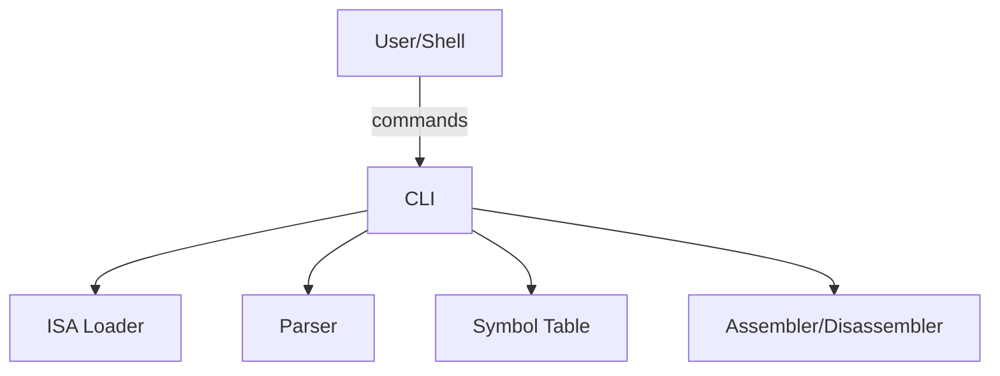

# Command-Line Interface (CLI)

## Overview

The Command-Line Interface (CLI) provides a comprehensive user interface to the py-isa-xform toolkit, enabling users to perform all major operations including ISA validation, assembly parsing, and program analysis through simple, intuitive commands.

## Installation and Setup

To use the `xform` command directly in your terminal (instead of `python3 -m src.isa_xform.cli`), you need to install the package and ensure the executable is in your PATH.

### Step 1: Install the Package

Install the package in development mode from the project root directory:

```bash
# Navigate to the project root directory
cd py-isa-xform

# Install in development mode
pip3 install -e .
```

### Step 2: Locate the Installed Command

After installation, find where pip installed the `xform` executable:

**On macOS/Linux:**
```bash
# Find your Python user base directory
python3 -m site --user-base

# The xform command will be in: <user-base>/bin/xform
# For example: /Users/username/Library/Python/3.9/bin/xform
```

**On Windows:**
```cmd
# Find your Python user base directory
python -m site --user-base

# The xform command will be in: <user-base>\Scripts\xform.exe
# For example: C:\Users\username\AppData\Roaming\Python\Python39\Scripts\xform.exe
```

### Step 3: Add to PATH (Choose One Method)

#### Method 1: Permanent PATH Setup (Recommended)

Add the Python user Scripts directory to your PATH permanently:

**For Windows (PowerShell) - Recommended:**
```powershell
# Get the user Scripts directory
$userBase = python -m site --user-base
$scriptsPath = "$userBase\Scripts"

# Add to PATH permanently for current user
[Environment]::SetEnvironmentVariable("PATH", "$env:PATH;$scriptsPath", "User")

# Refresh PATH for current session
$env:PATH += ";$scriptsPath"
```

**For Windows (Command Prompt):**
```cmd
# Get the user base directory (note the output)
python -m site --user-base

# Add to PATH permanently (replace <user-base> with actual path)
setx PATH "%PATH%;<user-base>\Scripts"

# Example:
# setx PATH "%PATH%;C:\Users\username\AppData\Roaming\Python\Python39\Scripts"
```

**For Windows (Manual GUI Method):**
1. Press `Win + R`, type `sysdm.cpl`, press Enter
2. Click "Environment Variables..."
3. Under "User variables", select "Path" and click "Edit..."
4. Click "New" and add: `C:\Users\<username>\AppData\Roaming\Python\Python39\Scripts` (replace with your actual path)
5. Click "OK" to close all dialogs
6. Restart your terminal/command prompt

**For macOS/Linux (Bash users)** - add to `~/.bashrc` or `~/.bash_profile`:
```bash
echo 'export PATH="$(python3 -m site --user-base)/bin:$PATH"' >> ~/.bashrc
source ~/.bashrc
```

**For macOS (Zsh users)** - add to `~/.zshrc`:
```bash
echo 'export PATH="$(python3 -m site --user-base)/bin:$PATH"' >> ~/.zshrc
source ~/.zshrc
```

**For Linux (Fish users)** - add to `~/.config/fish/config.fish`:
```bash
echo 'set PATH (python3 -m site --user-base)/bin $PATH' >> ~/.config/fish/config.fish
source ~/.config/fish/config.fish
```

#### Method 2: Manual PATH for Current Session Only

**For Windows (PowerShell):**
```powershell
$env:PATH += ";$(python -m site --user-base)\Scripts"
```

**For Windows (Command Prompt):**
```cmd
set PATH=%PATH%;%APPDATA%\Python\Python39\Scripts
```

**For macOS/Linux:**
```bash
export PATH="$(python3 -m site --user-base)/bin:$PATH"
```

#### Method 3: Use Full Path

If you prefer not to modify your PATH, you can always use the full path:

**On Windows:**
```cmd
# Example (replace with your actual path)
C:\Users\username\AppData\Roaming\Python\Python39\Scripts\xform.exe list-isas
```

**On macOS/Linux:**
```bash
# Example (replace with your actual path)
/Users/username/Library/Python/3.9/bin/xform list-isas
```

### Step 4: Verify Installation

Test that the `xform` command is working:

**On Windows:**
```cmd
# Check if xform is accessible
xform --help

# Test a basic command
xform list-isas
```

**On macOS/Linux:**
```bash
# Check if xform is accessible
xform --help

# Test a basic command
xform list-isas
```

You should see the help output and available ISA definitions.

**Note for Windows users:** If you get `'xform' is not recognized as an internal or external command`, you may need to:
1. Restart your Command Prompt/PowerShell after adding to PATH
2. Use `xform.exe` instead of just `xform`
3. Verify the PATH was added correctly with: `echo %PATH%` (CMD) or `$env:PATH` (PowerShell)

### Troubleshooting

#### Command Not Found

**On Windows** - if you get `'xform' is not recognized as an internal or external command`:

1. **Verify installation**: Check if `xform.exe` exists at the expected location:
   ```cmd
   dir "%APPDATA%\Python\Python39\Scripts\xform.exe"
   ```
2. **Check PATH**: Verify the Scripts directory is in your PATH:
   ```cmd
   echo %PATH% | findstr Scripts
   ```
3. **Restart terminal**: Close and reopen Command Prompt/PowerShell after modifying PATH
4. **Try with .exe extension**: Use `xform.exe` instead of `xform`
5. **Use full path**: As a fallback, use the complete path to the executable

**On macOS/Linux** - if you get `command not found: xform`:

1. **Verify installation**: Check if the executable exists at the expected location
2. **Check PATH**: Ensure the Python user bin directory is in your PATH
3. **Restart terminal**: Close and reopen your terminal after modifying PATH
4. **Use full path**: As a fallback, use the complete path to the executable

#### Permission Issues

**On macOS/Linux**, if you encounter permission errors:

```bash
# You might need to make it executable
chmod +x $(python3 -m site --user-base)/bin/xform
```

**On Windows**, permission issues are rare, but if encountered:

1. **Run as Administrator**: Try running Command Prompt or PowerShell as Administrator
2. **Check antivirus**: Some antivirus software may block newly installed executables
3. **Verify file exists**: Ensure the `xform.exe` file actually exists in the Scripts directory

#### Different Python Versions

If you have multiple Python versions, ensure you're using the same version for installation and execution:

**On Windows:**
```cmd
# Check your Python version
python --version

# Install with specific Python version if needed
py -3.9 -m pip install -e .
```

**On macOS/Linux:**
```bash
# Check your Python version
python3 --version

# Install with specific Python version if needed
python3.9 -m pip install -e .
```

### Alternative Installation Methods

#### System-wide Installation (requires admin/sudo)

```bash
# Install system-wide (not recommended for development)
sudo pip3 install -e .
```

#### Virtual Environment Installation

**On Windows:**
```cmd
# Create virtual environment
python -m venv venv

# Activate virtual environment
venv\Scripts\activate

# Install in virtual environment
pip install -e .

# xform will be available while the virtual environment is active
xform --help
```

**On macOS/Linux:**
```bash
# Create virtual environment
python3 -m venv venv

# Activate virtual environment
source venv/bin/activate

# Install in virtual environment
pip install -e .

# xform will be available while the virtual environment is active
xform --help
```

### Verification Commands

Once successfully installed, you can use these commands:

```bash
# Show help
xform --help

# List available ISAs
xform list-isas

# Validate an ISA
xform validate --isa simple_risc

# Parse assembly code
xform parse --isa simple_risc --input program.s

# Assemble code
xform assemble --isa simple_risc --input program.s --output program.bin

# Disassemble binary
xform disassemble --isa simple_risc --input program.bin --output output.s
```

## Design Philosophy

The CLI is designed with the following principles:

- **Simplicity**: Clear, consistent command syntax that follows standard conventions
- **Completeness**: Access to all toolkit functionality through command-line operations
- **Robustness**: Comprehensive error handling with informative error messages
- **Flexibility**: Support for both interactive use and automation/scripting
- **Extensibility**: Easy addition of new commands and options

## Command Structure

All commands follow a consistent structure:

```bash
xform <command> [options] [arguments]
```

### Global Options

All commands support these global options:

- `--help`, `-h`: Display help information for the command
- `--verbose`, `-v`: Enable verbose output with detailed information
- `--quiet`, `-q`: Suppress non-essential output
- `--version`: Display version information

## Available Commands

### `validate` - ISA Definition Validation

Validates ISA definition files for correctness and completeness.

**Syntax:**
```bash
xform validate --isa <file> [options]
```

**Options:**
- `--isa <file>`: Path to the ISA definition JSON file or ISA name (required)
- `--verbose`, `-v`: Display detailed validation information

**Examples:**
```bash
# Basic validation
xform validate --isa my_isa.json

# Verbose validation with detailed output
xform validate --isa my_isa.json --verbose

# Validate by ISA name
xform validate --isa simple_risc --verbose
```

**Output:**
- Success: "ISA definition is valid" message
- Failure: Detailed error messages with specific issues identified

### `parse` - Assembly Code Parsing

Parses assembly code and displays the Abstract Syntax Tree (AST) representation.

**Syntax:**
```bash
xform parse --isa <file> --input <file> [options]
```

**Options:**
- `--isa <file>`: Path to the ISA definition JSON file or ISA name (required)
- `--input <file>`: Path to the assembly source file (required)
- `--output <file>`: Output file for AST (optional, defaults to stdout)
- `--verbose`, `-v`: Display detailed parsing information

**Examples:**
```bash
# Basic parsing
xform parse --isa simple_risc --input program.s

# Verbose parsing with detailed information
xform parse --isa simple_risc --input program.s --verbose

# Save AST to file
xform parse --isa simple_risc --input program.s --output ast.json
```

**Output Formats:**

1. **Text Format** (default):
   ```
   LabelNode: main (line 5, column 1)
   InstructionNode: add r3, r1, r2 (line 6, column 5)
   DirectiveNode: .data (line 1, column 1)
   ```

2. **JSON Format**:
   ```json
   [
     {
       "type": "LabelNode",
       "name": "main",
       "line_number": 5,
       "column": 1
     },
     {
       "type": "InstructionNode",
       "mnemonic": "add",
       "operands": ["r3", "r1", "r2"],
       "line_number": 6,
       "column": 5
     }
   ]
   ```

3. **Tree Format**:
   ```
   AST:
   ├── DirectiveNode (.data)
   ├── LabelNode (main)
   └── InstructionNode (add r3, r1, r2)
   ```

### `assemble` - Assembly to Machine Code

Converts assembly code to machine code binary with optional metadata headers.

**Syntax:**
```bash
xform assemble --isa <file> --input <file> --output <file> [options]
```

**Options:**
- `--isa <file>`: Path to the ISA definition JSON file or ISA name (required)
- `--input <file>`: Path to the assembly source file (required, can specify multiple files)
- `--output <file>`: Path to the output binary file (required)
- `--list-symbols`: Display symbol table after assembly
- `--verbose`, `-v`: Display detailed assembly information
- `--raw`: Output raw binary without header (for bootloaders/legacy systems)

**Binary Output Format:**
- **Default**: Headered binary with entry point and metadata (recommended)
- **Raw**: Use `--raw` flag for raw machine code without headers

**Examples:**
```bash
# Basic assembly (headered binary by default)
xform assemble --isa simple_risc --input program.s --output program.bin

# Assembly with symbol listing
xform assemble --isa simple_risc --input program.s --output program.bin --list-symbols

# Assembly multiple files
xform assemble --isa simple_risc --input main.s data.s system.s --output program.bin

# Raw binary output (for bootloaders/legacy)
xform assemble --isa simple_risc --input program.s --output program.bin --raw
```

### `disassemble` - Machine Code to Assembly

Converts machine code binary back to assembly code with automatic header detection.

**Syntax:**
```bash
xform disassemble --isa <file> --input <file> --output <file> [options]
```

**Options:**
- `--isa <file>`: Path to the ISA definition JSON file or ISA name (required)
- `--input <file>`: Path to the binary input file (required)
- `--output <file>`: Path to the assembly output file (required)
- `--start-address <addr>`: Starting address for disassembly (default: auto-detect from header)
- `--show-addresses`: Show addresses in output
- `--show-machine-code`: Show machine code in output
- `--verbose`, `-v`: Display detailed disassembly information
- `--debug`: Show detailed PC progression and mode switches
- `--data-regions`: Specify custom data regions (overrides automatic detection)

**Binary Input Support:**
- **Headered Binaries**: Automatically detects entry point and starts disassembly correctly
- **Raw Binaries**: Uses ISA default or manual `--start-address` specification

**Examples:**
```bash
# Basic disassembly (automatic header detection)
xform disassemble --isa simple_risc --input program.bin --output disassembled.s

# Disassembly with addresses and machine code shown
xform disassemble --isa simple_risc --input program.bin --output disassembled.s --show-addresses --show-machine-code

# Disassembly with custom starting address (for raw binaries)
xform disassemble --isa simple_risc --input program.bin --output disassembled.s --start-address 0x1000

# Debug output with automatic data region detection
xform disassemble --isa zx16 --input program.bin --output disassembled.s --debug
```

## Error Handling

The CLI provides comprehensive error handling with different levels of detail:

### Error Types

1. **Usage Errors**: Invalid command syntax or missing required options
2. **File Errors**: Missing files, permission issues, or invalid file formats
3. **Validation Errors**: ISA definition validation failures
4. **Parsing Errors**: Assembly syntax or semantic errors
5. **System Errors**: Internal errors or resource limitations

### Error Output Format

```bash
# Usage error
xform: error: missing required argument: --isa

# File error
xform: error: file not found: 'nonexistent.json'

# Validation error
xform: error: ISA validation failed:
  - Missing required field 'instructions' in ISA definition
  - Invalid opcode value in instruction 'add': must be non-negative

# Parsing error
xform: error: parsing failed at line 5, column 10:
  - Unknown instruction 'invalid_instruction'
  - Expected register operand, got 'invalid_operand'
```

## Integration with Development Workflow

### Build System Integration

The CLI can be easily integrated into build systems:

```makefile
# Makefile example
program.bin: program.s simple_risc.json
	xform assemble --isa simple_risc --input program.s --output program.bin

validate-isa: simple_risc.json
	xform validate --isa simple_risc
```

### Scripting and Automation

```bash
#!/bin/bash
# Build script example

# Validate ISA definition
if ! xform validate --isa simple_risc; then
    echo "ISA validation failed"
    exit 1
fi

# Assemble program
if ! xform assemble --isa simple_risc --input program.s --output program.bin; then
    echo "Assembly failed"
    exit 1
fi

echo "Build completed successfully"
```

## Performance Considerations

### Large File Handling

For large assembly files, the CLI provides options to optimize performance:

```bash
# Parse large file with minimal output
xform parse --isa simple_risc --input large_program.s --quiet

# Validate ISA with progress indication
xform validate --isa large_isa.json --verbose
```

### Memory Usage

The CLI is designed to handle files efficiently:
- Line-by-line parsing for large assembly files
- Streaming processing where possible
- Configurable memory limits for very large files

## Configuration and Customization

### Environment Variables

The CLI respects these environment variables:

- `XFORM_VERBOSE`: Enable verbose output by default
- `XFORM_CONFIG`: Path to configuration file
- `XFORM_LOG_LEVEL`: Set logging level (DEBUG, INFO, WARNING, ERROR)

### Configuration Files

Create a configuration file `~/.xform/config.json`:

```json
{
    "default_isa": "simple_risc",
    "output_format": "text",
    "verbose": false,
    "strict_validation": true
}
```

## Troubleshooting

### Common Issues

1. **Command Not Found**: Ensure py-isa-xform is installed and in PATH
2. **Permission Denied**: Check file permissions and directory access
3. **Invalid JSON**: Use a JSON validator to check ISA definition files
4. **Parse Errors**: Review assembly syntax and ensure it matches ISA definition

### Debug Mode

Enable debug output for troubleshooting:

```bash
# Set debug environment variable
export XFORM_LOG_LEVEL=DEBUG

# Run command with debug output
xform parse --isa simple_risc --input program.s --verbose
```

## Future Enhancements

### Planned Features

- **Interactive Mode**: Command-line interface with history and completion
- **Batch Processing**: Process multiple files with a single command
- **Plugin System**: Support for custom commands and extensions
- **Web Interface**: Web-based GUI for ISA design and testing

### Extension Points

The CLI architecture supports easy extension:
- New commands can be added by implementing command handlers
- Custom output formats can be registered
- Validation rules can be extended
- Integration with external tools is supported

## Conclusion

The xform CLI provides a powerful, flexible interface for working with custom instruction set architectures. Its comprehensive feature set, robust error handling, and extensible design make it suitable for both educational use and professional development workflows.

The consistent command structure and detailed documentation ensure that users can quickly become productive with the toolkit, while the integration capabilities support automation and build system integration for more complex workflows.

## How It Fits Into the Project
- The CLI is the main entry point for users and scripts.
- It connects all core modules (ISA loader, parser, symbol table, assembler, disassembler).

## Example Usage
```bash
# Assemble a program
xform assemble --isa simple_risc --input program.s --output program.bin --verbose

# Disassemble a binary
xform disassemble --isa simple_risc --input program.bin --output program.s

# Validate an ISA
xform validate --isa simple_risc --verbose

# List available ISAs
xform list-isas --verbose

# Parse and show AST
xform parse --isa simple_risc --input program.s --verbose
```

## Diagram


## File Location
- `src/isa_xform/cli.py`
